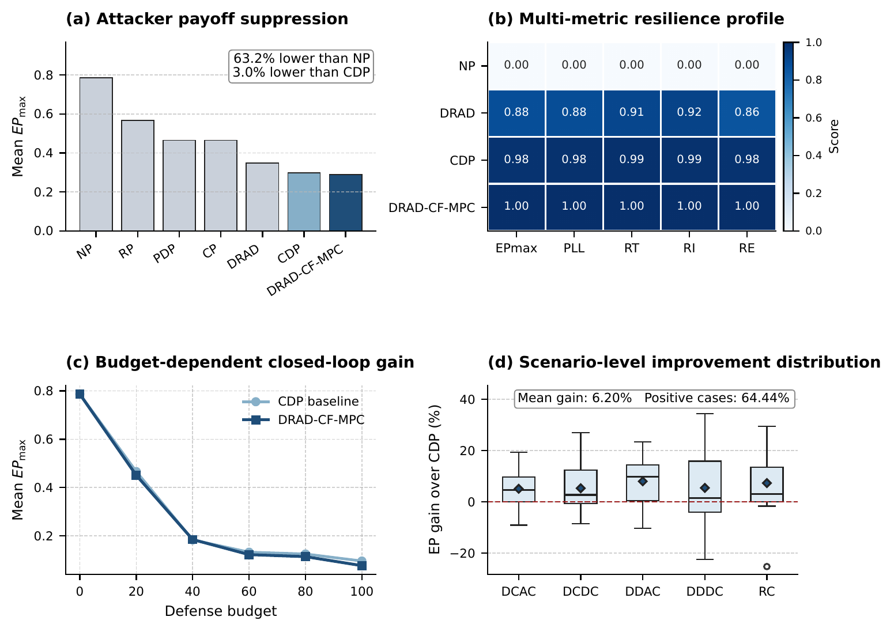
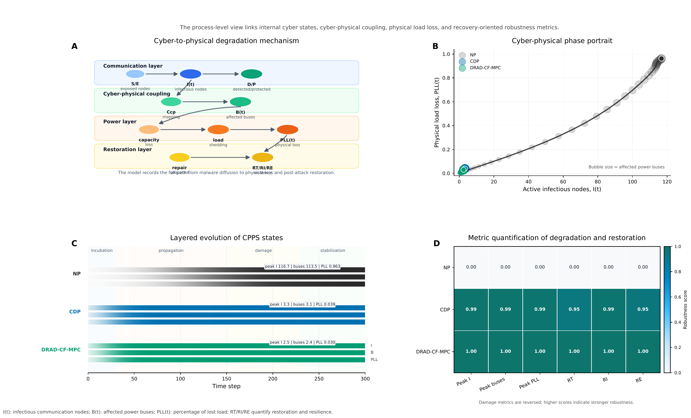
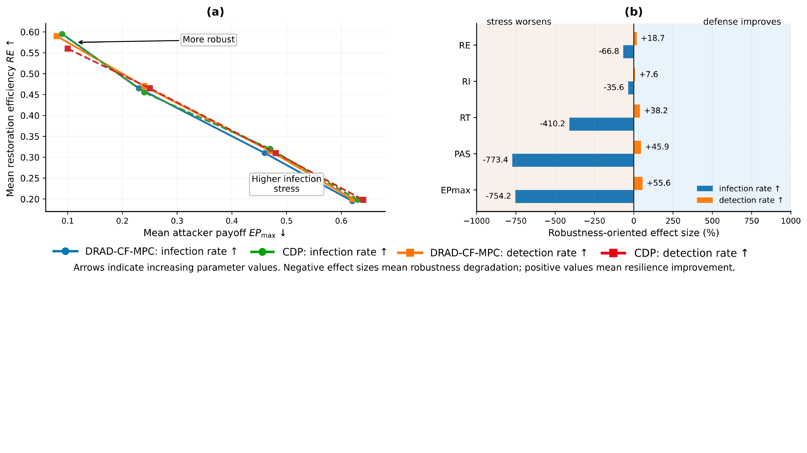
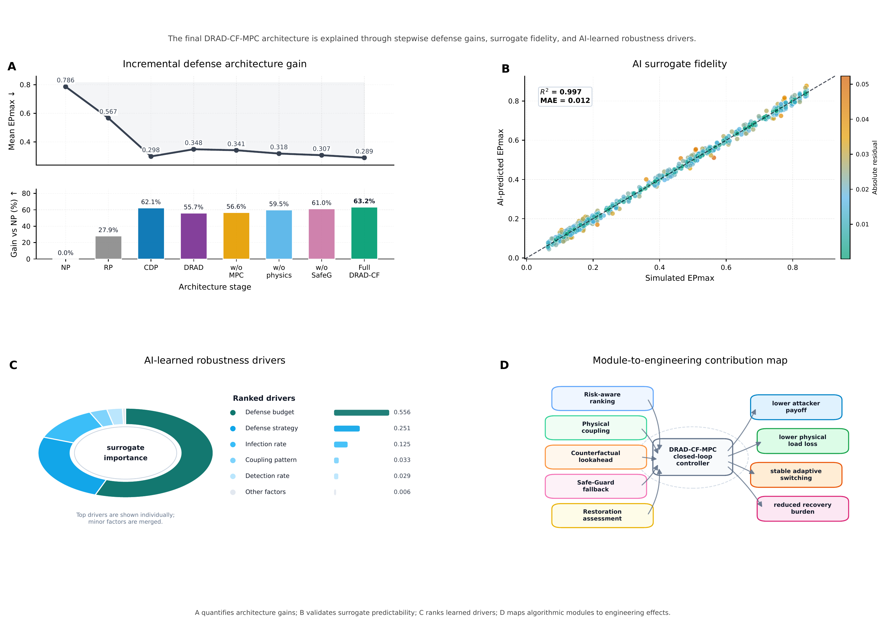

# DRAD-CF-MPC

Safe-Guarded Counterfactual Defense for Malware-Resilient Cyber-Physical Power Systems

This repository contains the simulation code, key result tables, and manuscript source for **DRAD-CF-MPC**, a dynamic risk-aware counterfactual model predictive control framework for malware-resilient cyber-physical power systems (CPPSs).

<p align="center">
  
</p>

## Highlights

- **State-to-consequence modeling**: malware diffusion in the communication layer is linked to affected physical service and post-attack recovery burden.
- **Interpretable candidate policies**: fixed baselines, dynamic risk-aware defense, and hybrid policies are evaluated under the same cyber-physical state.
- **Counterfactual MPC selection**: candidate defenses are compared with same-state rollouts so policy switching is driven by scenario-specific evidence.
- **Safe-Guarded adaptation**: the controller switches away from the strongest fixed baseline only when the counterfactual gain passes a conservative safeguard test.
- **Reproducibility package**: the released tables preserve the manuscript values, and `quick_check.py` verifies the main table, terminology, and Python syntax.

## Repository Structure

```text
DRAD-CF-MPC
├── assets/                 # PNG figures used by this README
├── logs/                   # main-run execution log
├── outputs/tables/         # released CSV tables used by the manuscript
├── paper/                  # LaTeX manuscript and paper figures
├── src/                    # simulation and defense code
├── CITATION.cff
├── LICENSE
├── README.md
├── REPRODUCIBILITY.md
├── quick_check.py
└── requirements.txt
```

## Method Overview

The malware process follows an SEID-style cyber-state model with an explicit protected state. Protected nodes are removed from infection and transmission in the current defense horizon.

<p align="center">
  
</p>

DRAD-CF-MPC evaluates candidate defense policies from the same observed cyber-physical state. Each policy is rolled out under common random seeds, scored by attacker payoff, affected service, restoration time, and resilience index, and then filtered by the Safe-Guard test before implementation.

## Installation

```bash
git clone https://github.com/VhoCheng/DRAD-CF-MPC.git
cd DRAD-CF-MPC

python -m venv .venv
source .venv/bin/activate
pip install -r requirements.txt
```

## Quick Check

Run a lightweight consistency check:

```bash
python quick_check.py
```

The check verifies that:

- the main strategy-level result table matches the manuscript values,
- PAS terminology is used consistently in the released code and tables,
- all released Python files pass syntax compilation.

## Reproducing the Main Experiment

The main experiment evaluates seven defense strategies over five cyber-physical coupling patterns, three attacker-information levels, six defense budgets, and eleven attack onset times.

```bash
python src/05_run_experiments_parallel.py
```

The reported configuration uses:

| Setting | Value |
|---|---:|
| Monte Carlo repetitions per task | 50 |
| Same-state counterfactual rollouts | 20 |
| Strategy-scenario-budget-timing tasks | 6930 |

The full run can take several hours depending on hardware. The precomputed CSV files in `outputs/tables/` preserve the manuscript result values.

## Main Results

The released main table is stored in `outputs/tables/experiment_strategy_summary_parallel.csv`.

| Strategy | Mean EPmax | Mean PAS | Mean RT | Mean RI | Mean RE |
|---|---:|---:|---:|---:|---:|
| DRAD-CF-MPC | 0.289 | 0.306 | 6.638 | 0.827 | 0.444 |
| CDP | 0.298 | 0.315 | 6.765 | 0.822 | 0.439 |
| DRAD-score | 0.348 | 0.369 | 7.657 | 0.796 | 0.402 |
| CP | 0.465 | 0.499 | 9.697 | 0.716 | 0.319 |
| PDP | 0.465 | 0.503 | 9.770 | 0.714 | 0.316 |
| RP | 0.567 | 0.611 | 11.529 | 0.647 | 0.244 |
| NP | 0.786 | 0.848 | 17.968 | 0.449 | 0.152 |

<p align="center">
  
</p>

## Paper Figures

The paper figures used for the README are included in `assets/`; the original paper figure files are retained in `paper/figures/`.

| Key-node evidence | Safe-Guarded switching |
|---|---|
|  |  |

| Degradation-recovery dynamics | Sensitivity analysis |
|---|---|
|  |  |

<p align="center">
  
</p>

## Released Data

Important CSV files:

- `outputs/tables/experiment_strategy_summary_parallel.csv`: main strategy-level comparison.
- `outputs/tables/experiment_results_optimal_parallel.csv`: scenario-level optimal results.
- `outputs/tables/experiment_results_raw_parallel.csv`: raw main-experiment strategy results.
- `outputs/tables/figure*_used.csv`: figure-level data used in the manuscript.
- `outputs/tables/comm_features.csv`, `power_features.csv`, and `coupling_*.csv`: CPPS benchmark features and coupling maps.

## Manuscript Source

The LaTeX source is provided under `paper/`:

```text
paper/main.tex
paper/cas-refs.bib
paper/figures/
```

## Citation

If you use this repository, please cite the accompanying manuscript:

```bibtex
@misc{cheng2026dradcfmpc,
  title  = {Safe-Guarded Counterfactual Defense for Malware-Resilient Cyber-Physical Power Systems},
  author = {Cheng, Weihao and Tu, Haicheng and Xia, Yongxiang and Chen, Xi},
  year   = {2026},
  note   = {Manuscript under review}
}
```

## License

This repository is released under the MIT License.
