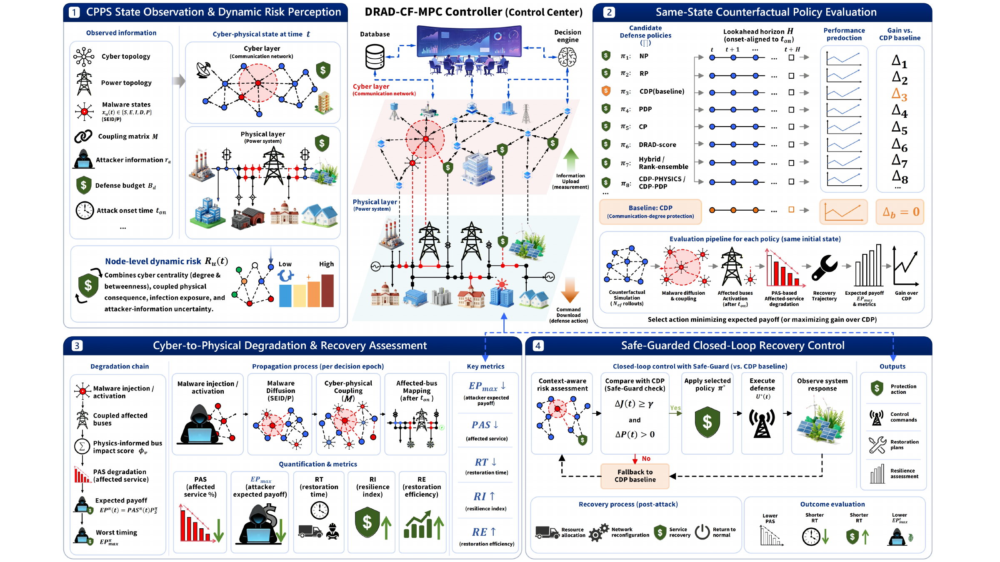
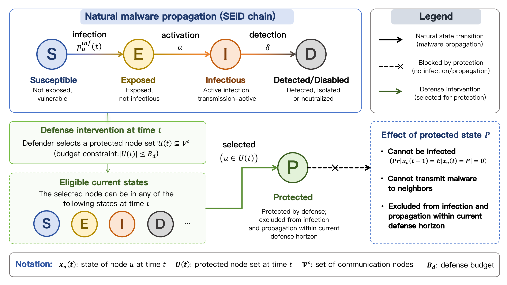
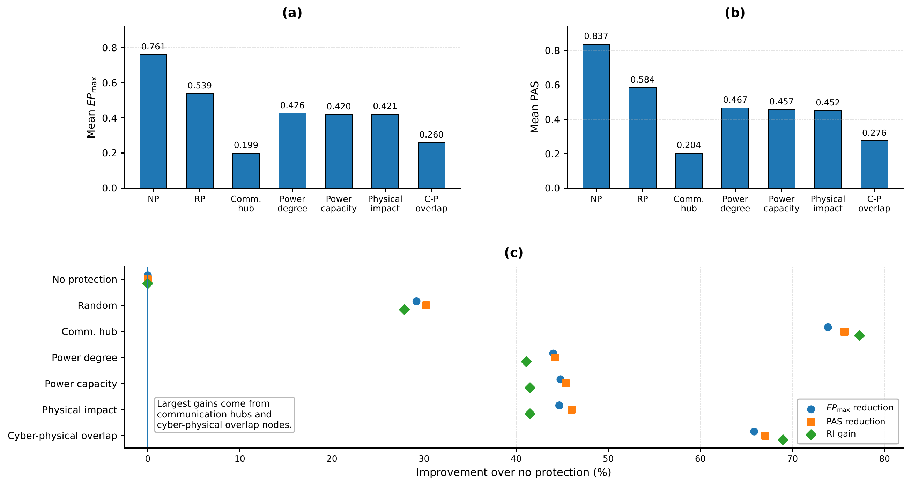
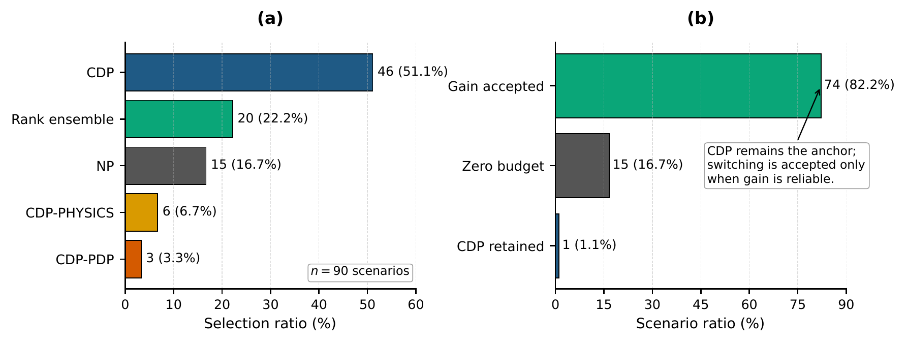
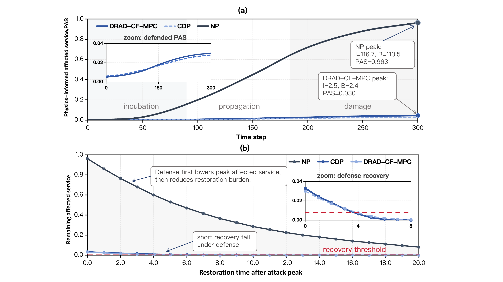
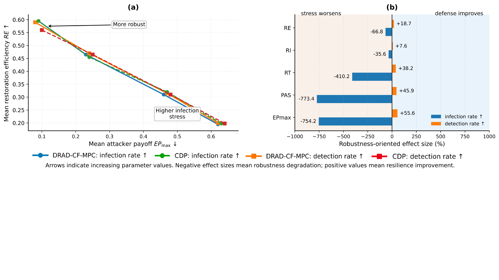

<div align="center">

# DRAD-CF-MPC

**Safe-Guarded Counterfactual Defense for Malware-Resilient Cyber-Physical Power Systems**

[](#-installation)
[](LICENSE)
[](#-quick-check)
[](#-main-result-table)

</div>

**DRAD-CF-MPC** is a reproducibility package for a dynamic risk-aware counterfactual model predictive control framework for malware-resilient cyber-physical power systems (CPPSs). It releases the simulation code, key result tables, execution log, and paper-used figures needed to inspect the reported results without exposing draft-only manuscript artifacts.

The public release intentionally excludes the LaTeX source file and BibTeX bibliography. Only figures used in the submitted manuscript are included.

<p align="center">
  
</p>

## ✨ Highlights

- **State-to-consequence modeling**: malware diffusion in the cyber layer is linked to affected physical service and restoration burden.
- **Physics-aware affected service metric**: cyber infection is evaluated through a CPPS service-impact proxy rather than as a purely cyber count.
- **Interpretable candidate defenses**: fixed baselines, dynamic risk-aware defense, and hybrid policies are evaluated under the same observed state.
- **Counterfactual MPC selection**: candidate policies are compared with common-random-number rollouts from the same state.
- **Safe-Guarded switching**: adaptive switching is accepted only when the predicted improvement over the baseline passes a conservative safeguard test.
- **Compact reproducibility package**: the released tables preserve the manuscript results and `quick_check.py` verifies the main table, PAS terminology, and Python syntax.

## 🗂 Repository Structure

```text
DRAD-CF-MPC
├── assets/                 # README figures converted from paper-used figures only
├── logs/                   # main-run execution log
├── outputs/tables/         # released CSV tables used by the manuscript
├── paper/figures/          # submitted-paper figure files only
├── src/                    # simulation and defense code
├── CITATION.cff
├── LICENSE
├── README.md
├── REPRODUCIBILITY.md
├── quick_check.py
└── requirements.txt
```

## 🧠 Method Overview

The malware process follows a protected SEID-style cyber-state model. Protected nodes are unavailable for infection and transmission in the current defense horizon.

<p align="center">
  
</p>

The proposed controller evaluates candidate defense policies from the same observed cyber-physical state, scores their counterfactual rollouts by degradation and recovery indicators, and implements adaptive switching only after the Safe-Guard test.

## 🔨 Installation

```bash
git clone https://github.com/VhoCheng/DRAD-CF-MPC.git
cd DRAD-CF-MPC

python -m venv .venv
source .venv/bin/activate
pip install -r requirements.txt
```

## 🚀 Quick Check

Run:

```bash
python quick_check.py
```

The check verifies that:

- the main strategy-level result table matches the manuscript values,
- PAS terminology is used consistently in the released code and tables,
- all released Python files pass syntax compilation.

## 🔁 Reproducing the Main Experiment

The main experiment evaluates seven defense strategies over five cyber-physical coupling patterns, three attacker-information levels, six defense budgets, and eleven attack onset times.

```bash
python src/05_run_experiments_parallel.py
```

The reported configuration uses:

| Setting | Value |
|---|---:|
| Monte Carlo repetitions per task | 50 |
| Same-state counterfactual rollouts per candidate | 20 |
| Strategy-scenario-budget-timing tasks | 6930 |

The full run can take several hours depending on the machine. The released CSV files in `outputs/tables/` preserve the manuscript result values.

## 📊 Main Result Table

The main strategy-level comparison is stored in `outputs/tables/experiment_strategy_summary_parallel.csv`.

| Strategy | Mean EPmax | Mean PAS | Mean RT | Mean RI | Mean RE |
|---|---:|---:|---:|---:|---:|
| DRAD-CF-MPC | 0.289 | 0.306 | 6.638 | 0.827 | 0.444 |
| CDP | 0.298 | 0.315 | 6.765 | 0.822 | 0.439 |
| DRAD-score | 0.348 | 0.369 | 7.657 | 0.796 | 0.402 |
| CP | 0.465 | 0.499 | 9.697 | 0.716 | 0.319 |
| PDP | 0.465 | 0.503 | 9.770 | 0.714 | 0.316 |
| RP | 0.567 | 0.611 | 11.529 | 0.647 | 0.244 |
| NP | 0.786 | 0.848 | 17.968 | 0.449 | 0.152 |

## 🖼 Paper-used Figures

The README shows each paper figure at most once. The overall framework and malware propagation/protection figures are already shown above, so this section visualizes the remaining paper-used evidence figures. Historical or discarded manuscript figures are intentionally excluded from this public release.

### Key-node Protection and Safe-Guarded Switching

| Key-node evidence | Safe-Guarded switching |
|---|---|
|  |  |

### Degradation-recovery Process Evidence

<p align="center">
  
</p>

### Sensitivity Analysis

<p align="center">
  
</p>

## 📁 Released Tables

Important CSV files:

- `outputs/tables/experiment_strategy_summary_parallel.csv`: main strategy-level comparison.
- `outputs/tables/experiment_results_optimal_parallel.csv`: scenario-level optimal results.
- `outputs/tables/experiment_results_raw_parallel.csv`: raw main-experiment strategy results.
- `outputs/tables/figure*_used.csv`: released figure-level data used in the manuscript.
- `outputs/tables/comm_features.csv`, `power_features.csv`, and `coupling_*.csv`: CPPS benchmark features and coupling maps.

## 📦 Package Scope

This package is designed for GitHub release and reproducibility checking. It includes runnable code, result CSV files, paper-used figures, and a run log. It does not include the LaTeX manuscript source or the BibTeX bibliography.

## 👥 Authors

| Author | Affiliation | Email |
|---|---|---|
| Weihao Cheng | School of Communication Engineering, Hangzhou Dianzi University, Hangzhou 310018, China | weihao_cheng@hdu.edu.cn |
| Haicheng Tu | School of Communication Engineering, Hangzhou Dianzi University, Hangzhou 310018, China | tuhc@hdu.edu.cn |
| Youjia Ling | School of Accounting, Hangzhou Dianzi University, Hangzhou 310018, China | lingyoujia@hdu.edu.cn |
| Yongxiang Xia | School of Communication Engineering, Hangzhou Dianzi University, Hangzhou 310018, China | xiayx@hdu.edu.cn |
| Xi Chen | Department of Artificial Intelligence, China Electric Power Research Institute, Beijing 100192, China | xc@ieee.org |

## 📝 Citation

If you use this repository, please cite the accompanying manuscript:

```bibtex
@misc{cheng2026dradcfmpc,
  title  = {Safe-Guarded Counterfactual Defense for Malware-Resilient Cyber-Physical Power Systems},
  author = {Cheng, Weihao and Tu, Haicheng and Ling, Youjia and Xia, Yongxiang and Chen, Xi},
  year   = {2026},
  note   = {Manuscript under review}
}
```

## 📜 License

This repository is released under the MIT License.
